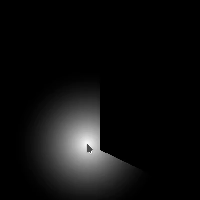

<p align="center"><a href="https://miguelmj.github.io/Candle"></a></p>
<h1 align="center">Candle</h1>
<h3 align="center">2D lighting for SFML</h3>
<p align="center">


<a href="https://miguelmj.github.io/Candle"></a>

<a href="LICENSE"></a>
</p>
Candle is a SFML based C++ library that provides light, shadow casting and field of view  functionalities with easy integration.

[Official documentation](https://miguelmj.github.io/Candle).

### Contents

- [Demo](#Demo)
- [Build](#Build)
- [Requisites](#Requisites)
- [Contributors](#Contributors)
- [Contributing](#Contributing)
- [Example program](#Example-program)
- [License](#License)

## Demo

Before anything, here you have a little example of how it looks.

<p align="center"></p>

The code comes with a demo program showing the functionalities provided by the library. In it you can place lights and edges that will cast shadows, and modify the behaviour of the fog.

You can check the full manual of the demo [here](https://miguelmj.github.io/Candle/demo_manual.html).

## Build

### CMake

You can build the static library and the demo program with CMake.

```shell
mkdir build && cd build
cmake .. -DBUILD_DEMO=ON
cmake --build .
```

This will generate `libCandle-s.a` or (`Candle-s.lib` on Windows) in `build/lib` folder, and the `demo` program (or `demo.exe`) in `build/bin`.

###  Make

Alternatively, if you work in Linux, you can use `make`, and also build the docs with it.

```bash
make
make docs # optional	
```

## Requisites


- **SFML v2.5.1**
  - Graphics module and System module.

_This library is meant to be used in SFML applications, so it's assumed that you are familiar with the process of compiling them. If you are not, [you can learn in the official website](https://www.sfml-dev.org/tutorials/2.5/)_ . 

- If you want to build the docs, Doxygen 1.9.1 is required.

## Contributors

Thanks to the people that have contributed to this project: ([emoji key](https://allcontributors.org/docs/en/emoji-key))

<!-- ALL-CONTRIBUTORS-LIST:START - Do not remove or modify this section -->
<!-- prettier-ignore-start -->
<!-- markdownlint-disable -->
<table>
  <tr>
    <td align="center"><a href="http://madour.github.io"><br /><sub><b>Modar Nasser</b></sub></a><br /><a href="https://github.com/MiguelMJ/Candle/issues?q=author%3AMadour" title="Bug reports">🐛</a> <a href="#infra-Madour" title="Infrastructure (Hosting, Build-Tools, etc)">🚇</a> <a href="https://github.com/MiguelMJ/Candle/commits?author=Madour" title="Documentation">📖</a></td>
    <td align="center"><a href="https://github.com/nightroy99"><br /><sub><b>nightroy99</b></sub></a><br /><a href="#translation-nightroy99" title="Translation">🌍</a> <a href="https://github.com/MiguelMJ/Candle/pulls?q=is%3Apr+reviewed-by%3Anightroy99" title="Reviewed Pull Requests">👀</a></td>
    <td align="center"><a href="https://my-gate.net/"><br /><sub><b>Lukas Dürrenberger</b></sub></a><br /><a href="https://github.com/MiguelMJ/Candle/issues?q=author%3AeXpl0it3r" title="Bug reports">🐛</a></td>
    <td align="center"><a href="http://gamepopper.co.uk/"><br /><sub><b>Tim Stoddard</b></sub></a><br /><a href="https://github.com/MiguelMJ/Candle/commits?author=gamepopper" title="Code">💻</a> <a href="https://github.com/MiguelMJ/Candle/issues?q=author%3Agamepopper" title="Bug reports">🐛</a> <a href="https://github.com/MiguelMJ/Candle/commits?author=gamepopper" title="Tests">⚠️</a></td>
    <td align="center"><a href="https://github.com/Dead-Deus"><br /><sub><b>Dead-Deus</b></sub></a><br /><a href="#infra-Dead-Deus" title="Infrastructure (Hosting, Build-Tools, etc)">🚇</a> <a href="https://github.com/MiguelMJ/Candle/issues?q=author%3ADead-Deus" title="Bug reports">🐛</a></td>
  </tr>
</table>

<!-- markdownlint-restore -->
<!-- prettier-ignore-end -->

<!-- ALL-CONTRIBUTORS-LIST:END -->

This project follows the [all-contributors](https://allcontributors.org/) specification.

## Contributing

- Read the [contributing guidelines](CONTRIBUTING.md) if you want to contribute to the code.
- Open a new issue [](https://github.com/MiguelMJ/Candle/issues/new) to make a request or report a bug.
- Alternatively, comment it on the [SFML forum](https://en.sfml-dev.org/forums/index.php?topic=27631)
- If you use it in a project, you don't have to give any credit. But if you did so, that would be fantastic!
- And of course, :star:  **star this repository** and give it some visibility [](https://github.com/MiguelMJ/Candle/stargazers).

## Example program

I will assume that you have SFML installed in your system. If we have a project with the following structure:

```
|- project
   |- libCandle-s.a
   |- main.cpp
   |- include
      |- Candle
         |- Candle.hpp
         |- ... # Candle headers
```

the `main.cpp` file could look like this:

```C++
#include <SFML/Graphics.hpp>
#include "Candle/RadialLight.hpp"
 
int main(){
    // create window
    sf::RenderWindow w(sf::VideoMode(400, 400), "app");
    
    // create a light source
    candle::RadialLight light;
    light.setRange(150);
    
    // create an edge pool
    candle::EdgeVector edges;
    edges.emplace_back(sf::Vector2f(200.f, 100.f), 
                       sf::Vector2f(200.f, 300.f));
    
    // main loop
    while(w.isOpen()){
        sf::Event e;
        while(w.pollEvent(e)){
            if(e.type == sf::Event::Closed){
                w.close();
            }else if(e.type == sf::Event::MouseMoved){
                sf::Vector2f mp(sf::Mouse::getPosition(w));
                light.setPosition(mp);
                light.castLight(edges.begin(), edges.end());
            }
        }
        
        w.clear();
        w.draw(light);
        w.display();
    }
    return 0;
}
```

We can compile it with the following command:

```shell
g++ -o app main.cpp -Iinclude -L. -lCandle-s -lsfml-graphics -lsfml-window -lsfml-system
```

And we run it

```shell
./app
```

The result will be a simple light casting a shadow over an invisible wall in the center of the window.

<p align="center"></p>

## License

Candle uses the MIT license, a copy of which you can find [here](LICENSE), in the repo.

It uses the external library SFML, that is licensed under the zlib/png license.

